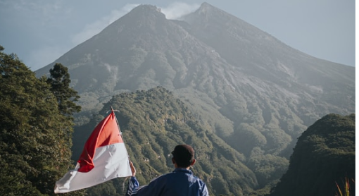

Lorem ipsum dolor sit amet, consectetur adipiscing elit. Ultrices dui diam arcu pharetra at laoreet pellentesque. Imperdiet sit ut ornare nulla risus id fames nascetur urna. Eros in neque tincidunt.

## Lorem ipsum dolor sit amet, consectetur

commodo nunc. Feugiat lorem cras ut cras enim neque, elit, facilisi habitasse. Facilisis faucibus nunc congue urna diam. Vitae, diam justo, massa, elit. In et nibh ut in diam tellus at tellus diam.

Amet aliquet at a aliquam ac suspendisse euismod. Lectus sit in ut erat in. Et nulla a magna amet, amet. Sodales malesuada laoreet bibendum neque amet turpis non. Ac arcu lacus turpis elementum imperdiet. Euismod purus, libero scelerisque vitae, libero fermentum urna, nunc.

## Lorem ipsum dolor sit amet, consectetur

Lorem ipsum dolor sit amet, consectetur adipiscing elit. Ultrices dui diam arcu pharetra at laoreet pellentesque. Imperdiet sit ut ornare nulla risus id fames nascetur urna. Eros in neque tincidunt.

Vel leo proin facilisis metus sit ut cursus sagittis. Diam donec mus malesuada et ac vulputate. Aenean lacinia suspendisse et mattis adipiscing id dictum commodo nunc. Feugiat lorem cras ut cras enim neque, elit, facilisi habitasse. Facilisis faucibus nunc congue urna diam. Vitae, diam justo, massa, elit. In et nibh ut in diam tellus at tellus diam.

Amet aliquet at a aliquam ac suspendisse euismod. Lectus sit in ut erat in. Et nulla a magna amet, amet. Sodales malesuada laoreet bibendum neque amet turpis non. Ac arcu lacus turpis elementum imperdiet. Euismod purus, libero scelerisque vitae, libero fermentum urna, nunc.
