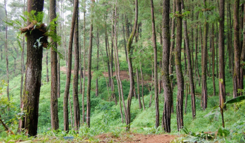

Hutan merupakan aset berharga yang memberikan banyak manfaat bagi kehidupan di Bumi. Namun, melihat kondisi saat ini, hutan-hutan di seluruh dunia, termasuk di Indonesia, mulai terancam oleh berbagai faktor seperti deforestasi, perambahan hutan, dan perubahan iklim.

## Langkah-langkah Menyelamatkan Hutan

1. **Pencegahan Deforestasi:** Mencegah deforestasi merupakan langkah kunci dalam menyelamatkan hutan. Ini bisa dilakukan melalui pengawasan yang ketat terhadap aktivitas illegal logging dan pembakaran hutan yang tidak terkontrol.
2. **Reboisasi dan Penanaman Kembali:** Melakukan kegiatan reboisasi atau penanaman kembali hutan-hutan yang telah ditebang adalah langkah penting untuk mengembalikan kelestarian hutan.

3. **Edukasi dan Kesadaran Masyarakat:** Mengedukasi masyarakat tentang pentingnya hutan dan dampak negatif dari kerusakan hutan dapat meningkatkan kesadaran untuk menjaga dan melestarikan hutan.

4. **Kerja Sama Internasional:** Kerja sama antarnegara dalam hal pengelolaan hutan dan perlindungan lingkungan sangat penting untuk mencapai tujuan kelestarian hutan global.

## Pentingnya Menyelamatkan Hutan

Menyelamatkan hutan bukan hanya untuk keberlangsungan hidup kita saat ini, tetapi juga untuk generasi mendatang. Hutan berperan sebagai penyerap karbon, menyediakan habitat bagi berbagai spesies flora dan fauna, serta menjaga keseimbangan ekosistem global.

Dengan melakukan langkah-langkah konkret untuk menyelamatkan hutan, kita dapat menjaga keberlangsungan hidup Bumi yang sehat dan asri untuk masa depan yang lebih baik.

Amet aliquet at a aliquam ac suspendisse euismod. Lectus sit in ut erat in. Et nulla a magna amet, amet. Sodales malesuada laoreet bibendum neque amet turpis non. Ac arcu lacus turpis elementum imperdiet. Euismod purus, libero scelerisque vitae, libero fermentum urna, nunc.
